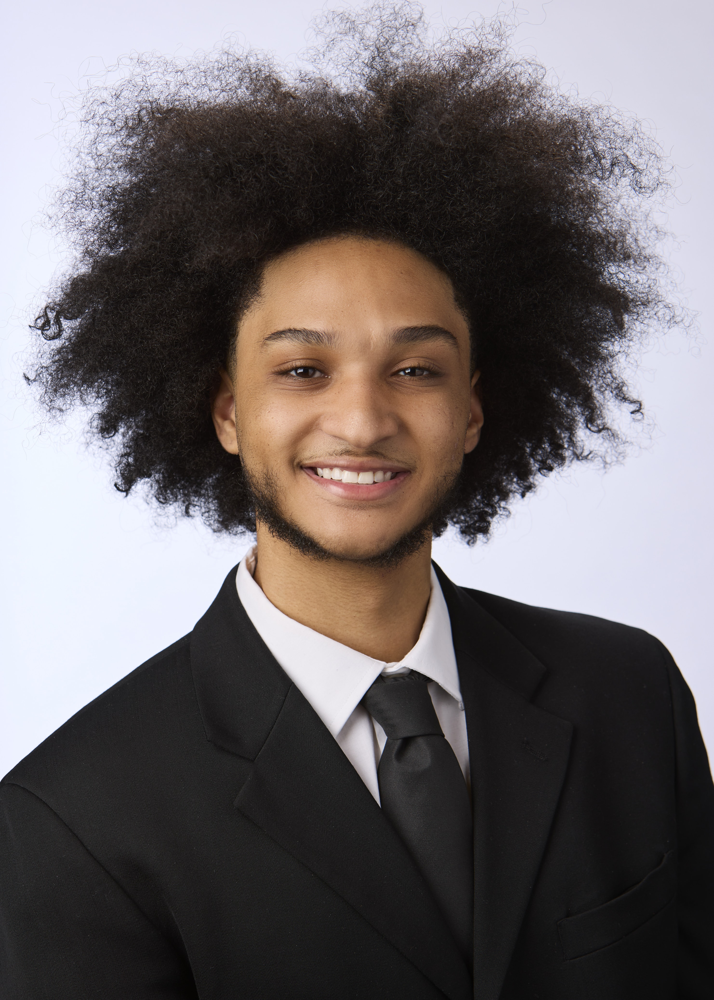

## Hey, I’m Sean 

Computer Science graduate from the University of Florida  
Full stack engineer who builds clean, reliable product experiences  

[LinkedIn](https://www.linkedin.com/in/seanlewertow/) ·
[Portfolio](https://seanlewertow.com/) ·
[Email](mailto:seanlewertow@gmail.com)

Former intern at Wells Fargo, American Airlines, and UKG.  
I enjoy building full stack apps that feel seamless, especially dashboards, workflows, and tools people use every day.

 

### What I like working on
• Full stack apps where frontend and backend actually feel connected  
• Automation and internal tools that save people time  
• Dashboards that turn messy data into something useful  
• Performance focused backend work  
• Practical AI features with a human in the loop  

---

### Projects

**Fade Finder**  
AI powered haircut recommendation tool that suggests styles based on face shape, hair texture, and reference images, inspired by my experience as a barber.

**MentorAI**  
AI study assistant that turns uploads into summaries, flashcards, and quizzes. Built core React UI and dashboard flow from upload to quiz.

**Discord Job Listings Bot**  
Automated system that pulls live job and internship listings and posts updates to a Discord community.

**Clips for a Cause**  
Full stack donation platform built with Next.js and AWS connecting groomers and hairstylists with community members through organized free haircut events.

**Friendly Neighborhood Guardians**  
C plus plus backend system comparing hash tables and B plus trees for fast lookup of public offender records across large government datasets.
